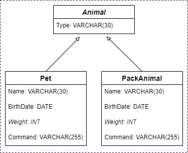

# (Потатуев Дмитрий, группа 6866)
# Объектно-ориентированное программирование

## 6. Диаграмма классов

### 6.1. Создать диаграмму классов с родительским классом "Животные", и двумя подклассами: "Pets" и "Pack animals".

#### В составы классов, в случае "Pets", войдут: Собаки, Кошки, Хомяки, а в класс "Pack animals" - Лошади, Верблюды и Ослы. Каждый тип животных будет характеризоваться, например, именем, датой рождения, выполняемыми командами и т.д. (Диаграмму можно нарисовать в любом редакторе, таких как Lucidchart, Draw.io, Microsoft Visio и других.)

## 7. Работа с MySQL

### 7.1. Структурировать базу данных "Human Friends" в соответствии с диаграммой, созданной в п. 6.

#### Например, можно создать таблицы, которые будут соответствовать классам "Pets" и "Pack animals", и в этих таблицах будут поля, которые характеризуют каждый тип животных (например, имена, даты рождения, выполняемые команды и т.д.).

Подключаемся к `MySQL`

### 7.2. В ранее подключенном MySQL, создать базу данных с названием "Human Friends".

#### 7.2.1. Создать таблицы, соответствующие иерархии диаграммы классов

Выбираем созданную базу данных `human_friends`.

Поскольку класс `Animal` является абстрактным, создаём таблицы только для классов `Pet` и `PackAnimal`.

Создаём таблицу `pets` для класса `Pet`.

Создаём таблицу `pack_animals` для класса `PackAnimal`.

Для обеих таблиц сделаем поля `type` и `name` обязательными.

Для таблицы `pets`: 

Для таблицы `pack_animals`: 

#### 7.2.2. Заполнить таблицы данными о животных, их командах и датами рождения

Заполняем таблицу `pets`: 

#### 7.2.3. Удалить записи о верблюдах и объединить таблицы лошадей и ослов

#### 7.2.4. Создать новую таблицу для животных в возрасте от 1 до 3 лет и вычислить их возраст с точностью до месяца

#### 7.2.5. Объединить все созданные таблицы в одну, сохраняя информацию о принадлежности к исходным таблицам

